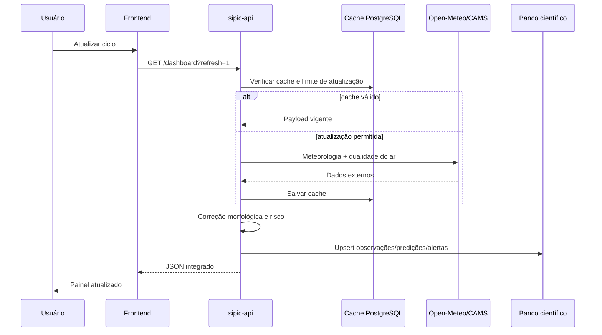

# Arquitetura técnica

## Componentes

### 1. Frontend

Aplicação estática em HTML, CSS e JavaScript puro. Não depende de framework, CDN ou chave secreta. O navegador chama somente a Edge Function pública.

Responsabilidades:

- navegação e responsividade;
- visualização dos ciclos;
- gráficos SVG;
- mapa térmico e setores;
- explicabilidade do modelo;
- exportação JSON/CSV/GeoJSON;
- contingência visual quando a API falha.

### 2. `sipic-api`

Edge Function de leitura pública.

Responsabilidades:

- consultar fontes externas;
- normalizar unidades e nomes;
- aplicar cache;
- calcular setores e riscos;
- produzir previsão de 48 horas;
- persistir observações calculadas e predições;
- gerar alertas e relatórios;
- expor endpoints estáveis ao frontend.

### 3. `sipic-ingest`

Edge Function autenticada.

Responsabilidades:

- validar JWT;
- validar código da estação;
- rejeitar valores fisicamente incompatíveis;
- registrar autoria e metadados;
- persistir observações instrumentais;
- atualizar a última telemetria.

### 4. PostgreSQL

Todas as entidades pertencentes ao projeto usam o prefixo `sipic_`, permitindo coexistência com outros sistemas no mesmo Supabase.

| Tabela | Finalidade |
|---|---|
| `sipic_sectors` | Setores e parâmetros morfológicos |
| `sipic_stations` | Sensores, grades e fontes |
| `sipic_observations` | Observações e variáveis calculadas |
| `sipic_predictions` | Previsões por setor e horizonte |
| `sipic_alerts` | Alertas térmicos deduplicados |
| `sipic_ingestion_runs` | Auditoria de ciclos de ingestão |
| `sipic_api_cache` | Cache das fontes externas |
| `sipic_reports` | Relatórios persistidos |
| `sipic_settings` | Configuração científica pública |

### 5. RLS

- Catálogo ativo: leitura pública.
- Observações: leitura pública da janela recente.
- Predições: leitura pública da janela recente.
- Alertas: somente ativos.
- Escritas: apenas service role/Edge Functions.
- Ingestão: função JWT, sem acesso direto da aplicação às tabelas.

## Fluxo de um ciclo

## Tolerância a falhas

1. A API tenta obter a fonte externa.
2. Em caso de erro, reutiliza o último cache válido.
3. O retorno sinaliza `stale`/`live_with_stale_cache`.
4. Se nem a fonte nem o cache estiverem disponíveis, o endpoint retorna erro explícito.
5. O frontend preserva a última visualização válida e informa o modo de contingência.

## Decisões de segurança

- Nenhuma service key no frontend.
- CORS público apenas na função de leitura.
- Função de ingestão exige JWT.
- Intervalos físicos são validados no servidor.
- `refresh=1` possui limitação mínima.
- Relatórios e alertas são gerados pelo servidor.
- O modelo não executa SQL recebido do cliente.
